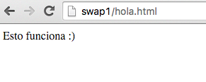

#Practica 1:Preparación de las herramientas

##Pasos:
Descargar Ubuntu 12.04.5 LTS (Precise pangolin) para 32 bits (i386)
http://cdimage.ubuntu.com/ubuntu-server/precise/daily/current/

###1. Configurar dos maquinas virtuales con VMWare Fusion, a la primera la llamaremos swap1 y a la segunda swap2

###2. Instalar las utilidades para máquinas virtuales
```
sudo apt-get install open-vm-tools
```

###3. Definir password root
```
sudo passwd root
```

###4. Hemos configurado el archivo hosts de nuestra máquina para que resuelva swap1 y swap2 sin tener que recordar la ip

###5. Hemos creado el archivo "hola.html" en /var/www/hola.html
```
sudo touch /var/www/hola.html
sudo vim /var/www/hola.html
```

##Resultados:
###1. Obtener el numero de versión del apache instalado:


###2. Consultar si hay algun proceso en el sistema con nombre apache:


###3. Consultamos la web desde el navegador



###4. Obtenemos la web mediante curl


