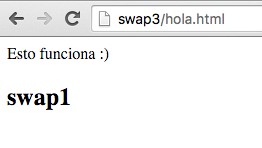
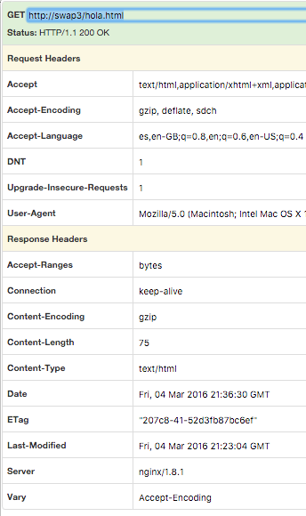

#Practica 3: Balanceo de carga

##Pasos:
###1. Nos hemos creado una nueva máquina **(swap3)** con la misma configuracion que las otras, pero sin apache

###2. Hemos instalado **nginx** desde el repositorio (hemos optimizado los pasos)
```
apt-key adv --fetch-keys http://nginx.org/keys/nginx_signing.key
echo "deb http://nginx.org/packages/ubuntu/ precise nginx" >> /etc/apt/sources.list
apt-get update
apt-get install nginx
```

###3. Comenzamos a configurar nginx editando el archivo */etc/nginx.conf.d/default.conf*
```
upstream apaches {
	server swap1; 
	server swap2;
}
server{
	listen 80;
	server_name balanceador;
	access_log /var/log/nginx/balanceador.access.log; 	error_log /var/log/nginx/balanceador.error.log; 	root /var/www/;
	location / {
		proxy_pass http://apaches;
		proxy_set_header Host $host;
		proxy_set_header X-Real-IP $remote_addr;
		proxy_set_header X-Forwarded-For 	$proxy_add_x_forwarded_for; 
		proxy_http_version 1.1;
		proxy_set_header Connection ""; 
	}
}

```
Tip: en lugar de indicarle las ips le indicamos los nombres que hemos definido el fichero *hosts*

###3. Comprobamos que al acceder desde nuestra maquina o desde el localhost en swap3 el contenido me lo va mostrando un servidor distinto alternativamente



```
curl localhost/hola.html
curl localhost/hola.html
```


Tip: Para simplificar la prueba hemos agregado el nombre del servidor al archivo *hola.html*

Podemos ver los headers con cualquier visor, aquí vemos como **nginx** se identifica en el nombre del server



###4. Hemos instalado **haproxy** mediante apt-get en swap3
```
apt-get install haproxy
vim /etc/haproxy/haproxy.cfg
```

```
global
        daemon
        maxconn 256
defaults
        mode http
        contimeout 4000
        clitimeout 42000
        srvtimeout 43000
frontend http-in 
        bind *:80
        default_backend servers
backend servers
        server m1 swap1:80 maxconn 32 
        server m2 swap2:80 maxconn 32
```

```
/usr/sbin/haproxy -f /etc/haproxy/haproxy.cfg
curl localhost/hola.html
curl localhost/hola.html
```

Curiosidad: Vemos en los headers que ahora devuelve como servidor Apache en lugar de nginx


###5. Hemos configurado el balanceador *pound* instalado desde el ppa: de amplidata
```
apt-get update
apt-get install pound
```
hemos configurado el archivo */etc/pound/pound.cfg*

```
ListenHTTP
        Address 0.0.0.0
        Port    80
        ## allow PUT and DELETE also (by default only GET, POST and HEAD)?:
        xHTTP           0
        Service
                BackEnd
                        Address swap1
                        Port    80
                        Priority 1
                End
                BackEnd
                        Address swap2
                        Port    80
                        Priority 1
                End
        End
End
```

Hemos cambiado el archivo necesario para que se pueda iniciar el demonio en */etc/default/pound* y lo hemos iniciado