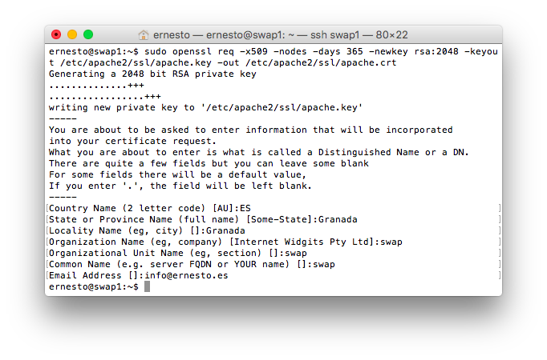
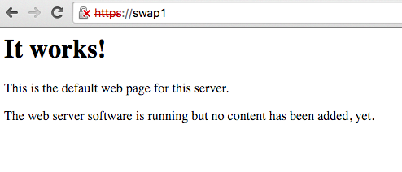
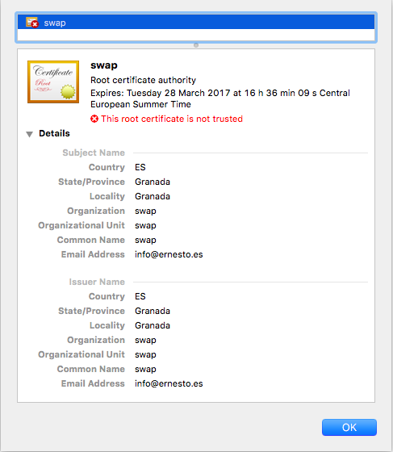
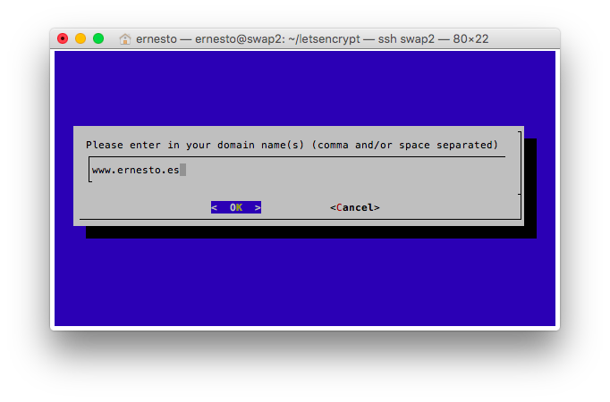

#Trabajo Final - Certificados SSL

# 1. Introducción

El protocolo SSL (Secure Sockets Layer) es un protocolo de comunicación que se ubica en la pila de protocolos sobre TCP/IP. SSL proporciona servicios de comunicación "segura"entre cliente y servidor, como por ejemplo autenticación (usando certificados), integridad (mediante firmas digitales), y privacidad (mediante encriptación).

El protocolo se diseñó de forma escalable permitiendo la elección de diversos algoritmos para la criptografía, compendios y firmas. Esto permite que la elección del algoritmo pueda hacerse teniendo en cuenta cuestiones legales, de exportación u otras preocupaciones, y también permite al protocolo aprovecharse de nuevos algoritmos. Las opciones se negocian entre el cliente y servidor al comienzo de la sesión.

Hay varias versiones del protocolo, la primera, SSL v1 fue creada por Netscape Corporation y nunca tuvo uso público. La versión 2 ya formaba parte de las primeras versiones del navegador Netscape Navigator. Actualmente la versión que SSLv3 se considera insegura y el nuevo estándar se llama **TLS** (Transport Layer Security), este nuevo protocolo ha sido diseñado por el **IETF** (Internet Engineering Task Force) como una ampliación de SSLv3 con mejoras en la forma de realizar la autenticación.

# 2. Que son

Un certificado SSL sirve para brindar seguridad al visitante de su página web, una manera de decirles a sus clientes que el sitio es auténtico, real y confiable para ingresar datos personales.

Un certificado SSL implementa el modelo preferido de seguridad en web, contiene claves digitales que protegen la integridad de sus datos al momento de enviar y recibir. Los servidores que corren SSL crean una vía con un cifrado único para las sesiones privadas a través de Internet, la clave pública del servidor está al alcance de cualquier persona. Es por eso que utilizan una clave pública y una clave privada: La clave pública es para cifrar la información, la clave privada sirve para descifrarla.

Al elegir un certificado SSL debe tomar cuenta los alcances deseados en su sitio web, la audiencia que tendrá acceso y por último el tipo de sesión que el usuario realizará.

# 3. Tipos de certificados

## 3.1. Certificado SSL/TLS estándar

El certificado de servidor estándar permite establecer comunicaciones seguras con sus clientes utilizando el protocolo SSL/TLS. Este tipo de certificados garantiza la identidad del nombre del dominio donde se encuentra su servicio Web. Es el más indicado para la mayoría de los casos.

## 3.2. Certificado SSL/TLS Plus

Permite tener un mayor control sobre el uso que se le dará al certificado: además de contar con las características del certificado SSL/TLS estándar se puede solicitar que el certificado se emita con los usos extendidos de clave de 'autenticación de cliente' y/o ‘protección de correo electrónico'.

## 3.3. Certificado wildcard

El certificado wildcard identifica todos los subdominios asociados a un dominio determinado, sin necesidad de adquirir y gestionar múltiples certificados electrónicos. Por ejemplo, el certificado wildcard emitido a "*.ejemplo.es" garantiza la identidad de dominios como compras.ejemplo.es, ventas.ejemplo.es o altas.ejemplo.es.

## 3.4. Certificado SAN

Si requiere proteger con un solo certificado dominios con diferentes niveles de profundidad o diferente dominio base, como por ejemplo www.subdominio.ejemplo.com y mail.otrodominio.es, deberá solicitar un certificado de tipo SAN.

El certificado de tipo SAN, también conocido como certificado multidominio, UC o Unified Communications Certificates, permite securizar con un solo certificado hasta doce dominios diferentes.

# 4. Ventajas en SEO de los certificados SSL

Desde el 6 de agosto de 2014, Google ofrece a los sitios web una ligera mejora en su posición en las búsquedas si añaden un certificado SSL de 2048-bit. Aunque no es una gran mejora y afecta a un bajo número de sitios web en este momento, es un presagio de lo que está por venir.

Por lo general, no existen ventajas reales en usar SSL para proteger todo tu sitio web si no estás procesando transacciones económicas. Como muchos ya han señalado, el movimiento de Google tiene que ver más con la política y las relaciones públicas que con mejorar la calidad de las clasificaciones de búsqueda. Por supuesto, el cifrado total de un sitio puede, en algunos casos, reducir las brechas de seguridad. Eso siempre es bueno para los usuarios finales. Sea como sea, hacer que tu sitio use HTTPS en lugar de HTTP por defecto vale la pena, ya que demuestra un compromiso con una mejor experiencia de los usuarios a través de una mayor seguridad.

# 5. Cómo identificar un certificado SSL

A nivel usuario, utilizar **https** es muy sencillo, casi transparente, solo tendremos que fijarnos en la barra de direcciones de nuestro navegador para identificar un candado verde si todo es correcto, a continuación se puede ver una tabla donde se ven los ejemplos mas comunes a la hora de conectarse a una página https:

<table>
  <tr>
    <td></td>
    <td></td>
    <td></td>
  </tr>
  <tr>
    <td>Candado verde</td>
    <td>Sin candado o candado con advertencia</td>
    <td>Candado rojo o tachado</td>
  </tr>
  <tr>
    <td>Todo correcto, pagina segura</td>
    <td>Página segura que carga elementos no seguros</td>
    <td>Página con un certificado caducado, falso o autofirmado</td>
  </tr>
</table>

# 6. Cómo obtenerlos

A nivel administrador de sistemas podemos encontrar diversas formas de obtener un certificado SSL e instalarlo en nuestro servidor web para poder servir páginas mediante el protocolo https, para ello, lo principal es conseguir un certificado que podremos conseguir de las siguientes formas:

## 6.1. Autoridades certificadoras:

Una autoridad de certificación, certificadora o certificante (AC o CA por sus siglas en inglés Certification Authority) es una entidad de confianza, responsable de emitir y revocar los certificados digitales o certificados, utilizados en la firma electrónica, para lo cual se emplea la criptografía de clave pública.

	A continuación puedes ver los logotipos de algunas de las autoridades certificadoras más conocidas.

	Como curiosidad apuntar que la empresa Thawte, que fue vendida a Verisign en 1999, fue creada por Mark Shuttleworth, que empleó el dinero de dicha venta en fundar el proyecto Ubuntu.

## 6.2. Certificados autofirmados

	Podemos crear nuestros propios certificados ssl auto-firmados usando la herramienta openssl, hay que tener en cuenta que dichos certificados no están avalados por ninguna CA, por lo que se no se recomienda su uso, ya que es relativamente fácil sufrir un ataque MitM (Man in the Middle) que nos sustituya un certificado por otro y con la consiguiente posibilidad de robo de datos.

## 6.3. El Proyecto Let's Encrypt

Let's Encrypt es un esfuerzo, impulsado por la Linux Foundation, para crear una entidad certificadora que ofrece certificados SSL abiertos, libres, gratuitos y automáticos que ha emitido mas de un millón de certificados desde su salida de la fase beta en noviembre de 2015.

El modo de funcionar de Let's Encrypt es muy sencillo, tiene una serie de paquetes en python para solicitar y auto-configurar un certificado en un servidor Linux con Apache, dichos certificados tienen una validez de 3 meses pero se anima a los administradores a que automaticen la renovación de los certificados mediante una tarea cron.

# 6. Generar e instalar un certificado autofirmado

Para generar un certificado SSL autofirmado en Ubuntu Server 12.04 solo debemos activar el módulo ssl de apache, generar los certificados y especificarle la ruta a los certificados en la configuración:

<table>
  <tr>
    <td>ernesto@swap1:~$ sudo sudo a2enmod ssl
ernesto@swap1:~$ sudo service apache2 restart
ernesto@swap1:~$ sudo mkdir /etc/apache2/ssl
sudo openssl req -x509 -nodes -days 365 -newkey rsa:2048 -keyout /etc/apache2/ssl/apache.key -out /etc/apache2/ssl/apache.crt</td>
  </tr>
</table>

Nos pedirá una serie de datos para el dominio (nombre, ciudad, etc…)

Editamos el archivo de configuracion del sitio default-ssl:

<table>
  <tr>
    <td>sudo vim /etc/apache2/sites-available/default-ssl</td>
  </tr>
</table>

Y agregamos estas lineas debajo de donde pone SSLEngine on:

SSLCertificateFile /etc/apache2/ssl/apache.crt

SSLCertificateKeyFile /etc/apache2/ssl/apache.key

Activamos el sitio default-ssl y reiniciamos apache:

<table>
  <tr>
    <td>ernesto@swap1:~$ sudo a2ensite default-ssl
ernesto@swap1:~$ sudo service apache2 reload</td>
  </tr>
</table>

Una vez reiniciado apache, si accedemos a [https://swap1/](https://swap1/) veremos lo siguiente:

Podemos ver que sale en rojo https:, al mostrar la información del certificado veremos lo siguiente:

# 7. Obtener e instalar un certificado Let's Encrypt

Vamos a obtener un certificado let's encrypt de forma manual porque lo vamos a instalar en un servidor local, aunque en un servidor con dominio sería mucho más sencillo porque hace la validación de forma automática.

Una cosa muy importante a tener en cuenta es que let's encrypt solo emite el certificado si podemos acreditar que somos los propietarios de un dominio, por lo que nos solicitará que pongamos unos archivos en una determinada ruta, si no tenemos un dominio (y un hosting) que nos permita hacer esto no podremos configurar el certificado.

Lo primero instalamos git, pues en ubuntu server no viene por defecto:

<table>
  <tr>
    <td>ernesto@swap2:~$ sudo apt-get install git</td>
  </tr>
</table>

Clonamos el repositorio git de let's encrypt.

<table>
  <tr>
    <td>ernesto@swap2:~$ git clone https://github.com/letsencrypt/letsencrypt</td>
  </tr>
</table>

Procedemos a usar el script automatizado que nos irá guiando a través de una interfaz ncurses.

<table>
  <tr>
    <td>ernesto@swap2:~/letsencrypt$ ./letsencrypt-auto certonly --manual</td>
  </tr>
</table>

Tendremos que poner en nuestro hosting un archivo en la siguiente ruta: http://www.ernesto.es/.well-known/acme-challenge/wGy4RyfXnoZdxQTmz5gXiV7aHT3fMV0

que contenga lo siguiente:

wGy4RyfXnoZdxQTmz5gXiV7aHT3fMV0OVM26zwytXlg.Prj_SAsLhv66snl6FKjcD8RB50zGW74Ls_CishAkbcM

Si tenemos acceso ssh en nuestro servidor lo podremos hacer con los siguientes comandos:

<table>
  <tr>
    <td>mkdir -p /tmp/letsencrypt/public_html/.well-known/acme-challenge
cd /tmp/letsencrypt/public_html
printf "%s" wGy4RyfXnoZdxQTmz5gXiV7aHT3fMV0OVM26zwytXlg.Prj_SAsLhv66snl6FKjcD8RB50zGW74Ls_CishAkbcM > .well-known/acme-challenge/wGy4RyfXnoZdxQTmz5gXiV7aHT3fMV0OVM26zwytXlg</td>
  </tr>
</table>

Una vez hecho eso y dándole a validar, nos generará los archivos necesarios para configurar apache, configurandolo de la misma manera que un certificado autofirmado.

Para hacerlo en un servidor apache con un dominio apuntando es mucho mas sencillo, pues solo tenemos que llamar al script mediante el comando  ./letsencrypt-auto --apache y él solito se encargará de configurar y verificar el certificado.

Para renovar el certificado (caduca a los 90 días) podemos llamar al script ./letsencrypt-auto renew, lo ideal es poner esto en el crontab y así se hará automágicamente.

# 8. Conclusiones

	En esta pequeña introducción hemos conocido qué son y para qué sirven los certificados SSL, así como su importancia a la hora de establecer comunicaciones seguras entre usuarios y servidores web.

# 9. Bibliografía

*  Network Working Group (May 2000). ["HTTP Over TLS"](https://tools.ietf.org/html/rfc2818). The Internet Engineering Task Force.

* [https://en.wikipedia.org/wiki/Transport_Layer_Security](https://en.wikipedia.org/wiki/Transport_Layer_Security)

* [https://en.wikipedia.org/wiki/HTTPS](https://en.wikipedia.org/wiki/HTTPS)

* [https://en.wikipedia.org/wiki/OpenSSL](https://en.wikipedia.org/wiki/OpenSSL)

* [https://www.sslshopper.com/article-a-short-history-of-verisign.html](https://www.sslshopper.com/article-a-short-history-of-verisign.html)

* [https://servidordebian.org/es/squeeze/intranet/ssl_cert/self_signed](https://servidordebian.org/es/squeeze/intranet/ssl_cert/self_signed)

* ["HTTPS as a ranking signal"](http://googlewebmastercentral.blogspot.com/2014/08/https-as-ranking-signal.html). *Google Webmaster Central Blog*. Google Inc. August 6, 2014.

